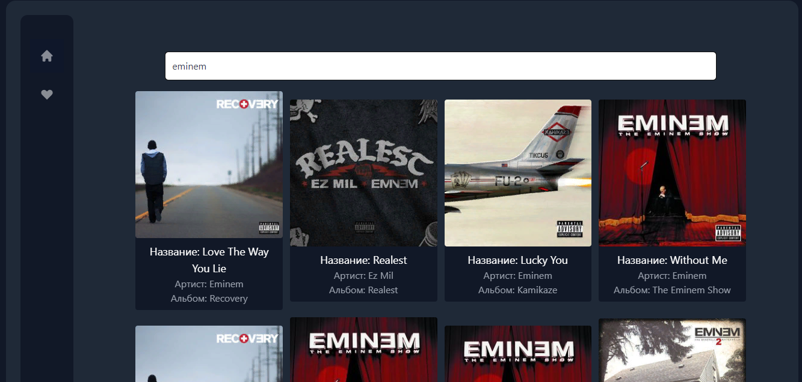

# Музыкальный плеер на Vue.js

Этот проект представляет собой простой музыкальный плеер, разработанный с использованием фреймворка Vue.js. Плеер предоставляет возможность прослушивания и управления музыкальными треками, а также сохранения выбранных треков в вашей библиотеке.



## Особенности

* Прослушивание музыки: Вы можете проигрывать треки из вашей музыкальной библиотеки.
* Поиск и добавление треков: Вы можете искать новые треки и добавлять их в вашу библиотеку.
* Управление библиотекой: Вы можете управлять вашей музыкальной библиотекой, послушивая и удаляя треки.

## Технологии

* `Vue.js`: Фреймворк для разработки веб-приложений.
* `Vuex`: Управление состоянием приложения.
* `Deezer-API`: Используется для получения информации о музыкальных треках.
* `Tailwind`: CSS-фреймворк для стилизации интерфейса.

## Установка

Склонируйте репозиторий:

```bash
git clone https://github.com/yato90/yam-music.git
cd yam-music
npm install
```
## Запуск

```bash
npm run dev
```
